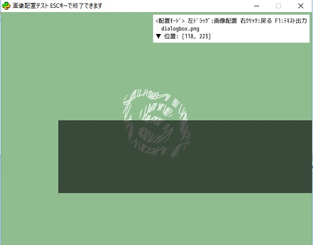

ImageTest
===

imageフォルダ内の画像を全部表示する。
画像を選択し、配置し、その座標を見て、そのデータをテキスト出力できる。
以上の操作はマウスですべて出来るし、キーボードでもすべて出来る。

## Usage

    Select Image Mode
        Mouse
            Mouse wheel: Choose images
            Left Click: To Place Image Mode
        Keyboard
            Up, Down: Choose images
            Z: To Place Image Mode

    Place Image Mode
        Mouse
            Left Click: Move image
            Right Click: To Select Image Mode
        Keyboard
            Cursor keys: Move image
            X: To Select Image Mode

    Others
        F1, Mouse Click 2: Output data as text file
